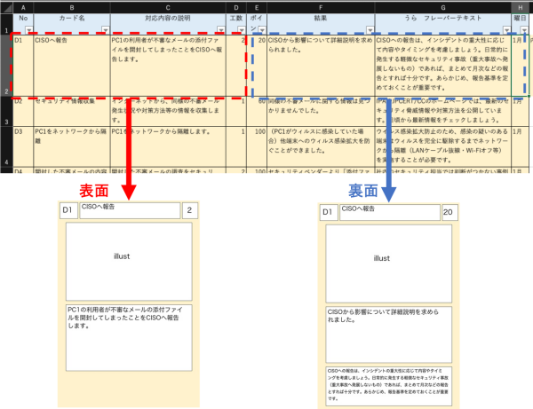

# Excel2Card

## これはなに
Excel2Cardです。Excelのリストからカードゲーム用のカードを自動生成します。こんなかんじ↓↓↓

以下の機能に対応しています。
- ⭐エクセルからpng画像を自動生成
- ⭐曜日によって色分け
- ⭐長い文章も枠に合わせてなんかいい感じに改行する

以下の機能に対応していません（そのうちがんばります）
- 😢必要なディレクトリの有無を検出して自動生成
- 😢エクセルの行の終わりを自動で判別して止まる
- 😫印刷用に両面を揃えて配置していい感じのA4サイズの画像にする（やりたくない
- 😢使いやすいコマンドオプション

## 事前準備
- 必要なライブラリのインストール

  `pip3 install openpyxl Pillow textwrap3 `

- ディレクトリの作成

  `mkdir front/ rear/`

## 使い方
### 下処理
1. Excelのファイル名・シート名を[cardsheet.xlsx][sheet1]に変更してExcel2Cards直下（excel2card.pyと同じディレクトリ）に置きます。
2. 不要な行・列を削除してください（上図参照）。

### 実行
1. excel2card.pyを動かします。

  `python excel2card.py`

　　※7行目のflag_viewの値を指定するとカードの生成・確認のみを切り替えできます。

2. /front および /rear ディレクトリ配下にカードが生成されます

## 動作確認環境
- Python：3.7.3
- OS:macOS Catalina

## 注意
- ExcelファイルのフォーマットはCHISIRTカードゲームプロジェクトで使っているものに準拠しています。（持っていることが前提です。機密のため上記画像以外はアップロードしません。）
- カードフォーマットは常に調整中です。
- 【重要】anaconda環境だとpipとケンカしてうまく動かないかもしれません。（調査中です）

## Contributing
好きにissueやプルリクお願いします🙌
