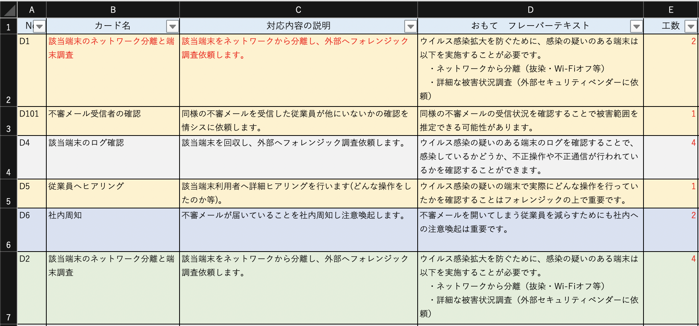

# Excel2Card

## これはなに
Excel2Cardです。Excelのリストからカードゲーム用のカードを自動生成します。

こんなかんじ↓↓↓

↓↓↓↓↓↓↓↓↓↓↓↓↓↓↓↓↓↓↓↓↓↓↓↓↓↓↓↓↓↓

## 使い方
1. Excelのファイル名・シート名を[cardsheet.xlsx][sheet1]に書き換えます。
2. [card]ディレクトリを作成します。

  `mkdir card`

3. excel2card.pyを動かします

  `python excel2card.py`

4. /card ディレクトリ配下にカードが生成されます。
5. うれしい！

## 注意
- ExcelファイルのフォーマットはCHISIRTカードゲームプロジェクトで使っているものに準拠しています。（持っていることが前提です）
- カードフォーマットは[調整中]です。
